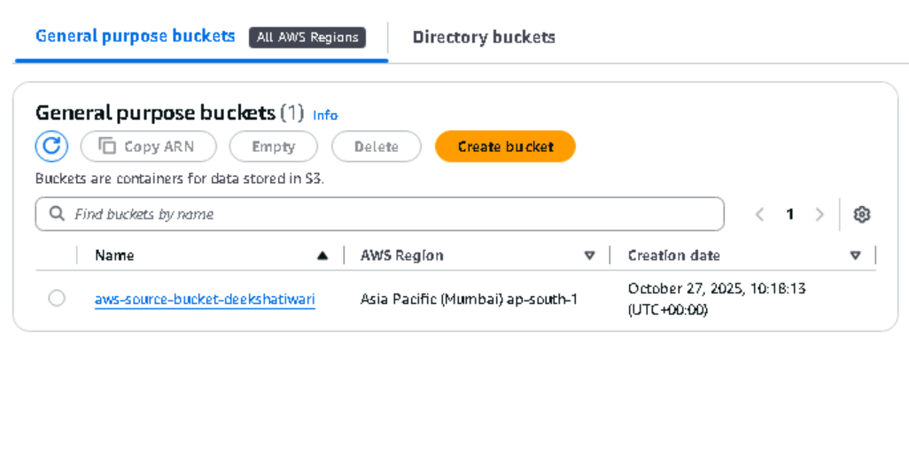
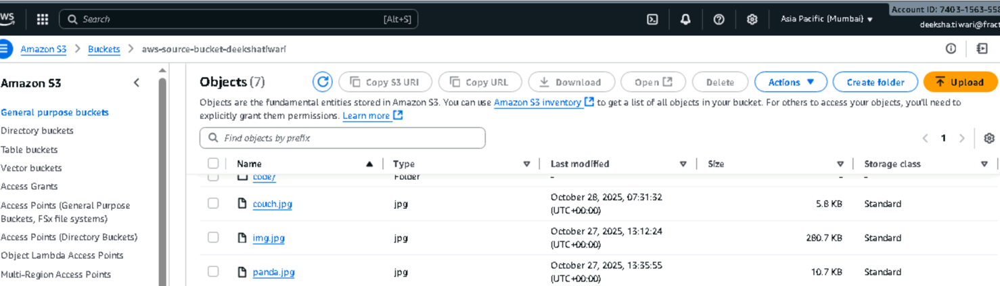
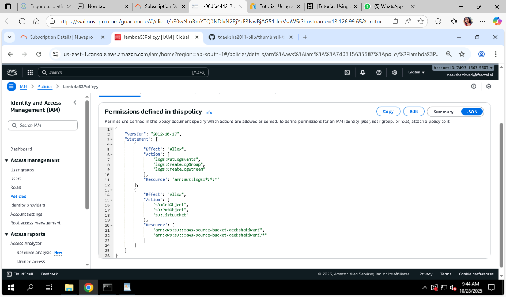
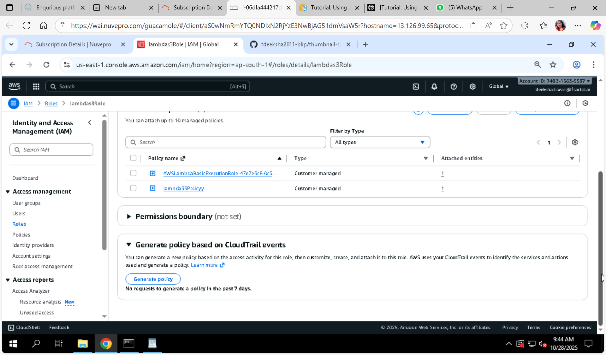
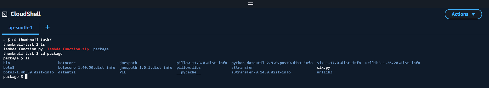
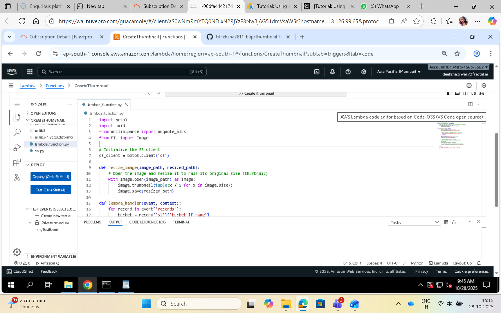
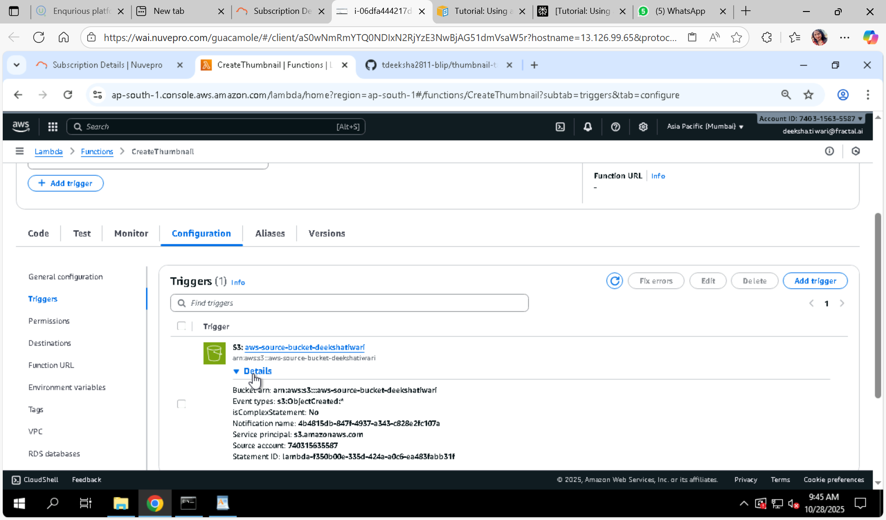
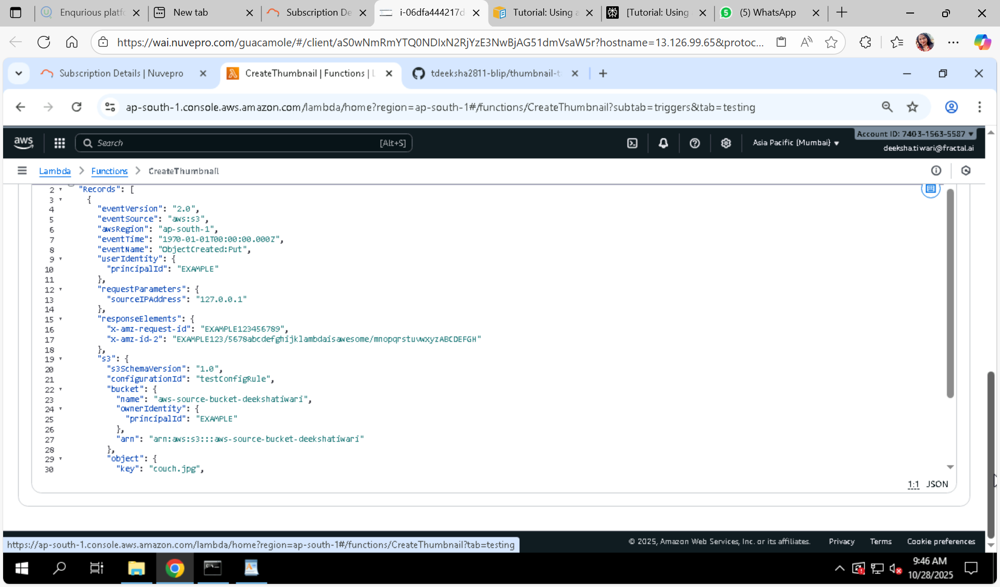
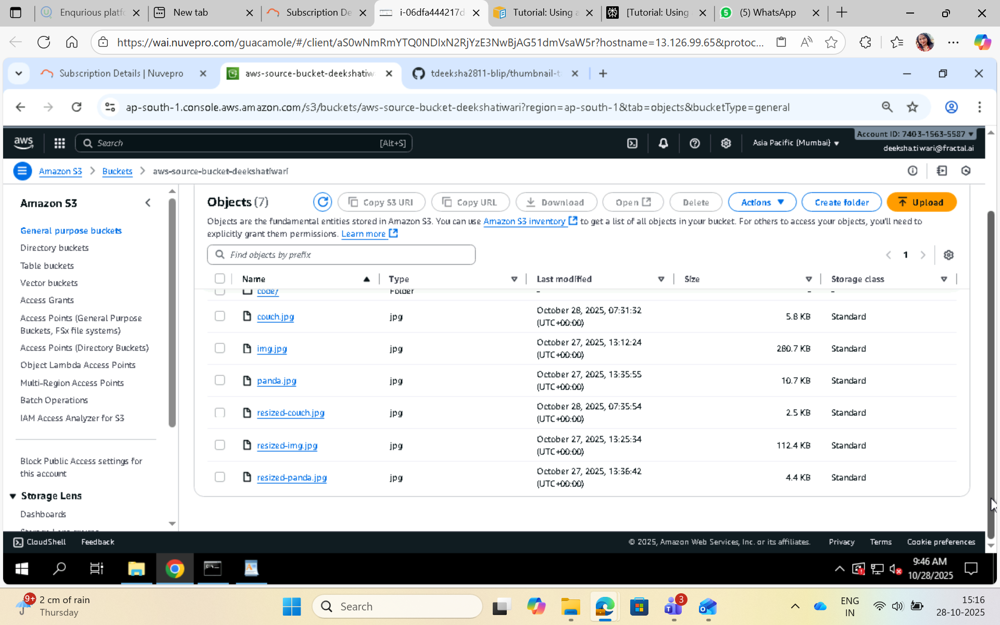

# Create Thumbnail Images with AWS Lambda & S3 Trigger

This project demonstrates how to create and configure an AWS Lambda function that automatically generates thumbnail images when a new image is uploaded to an Amazon S3 bucket. The Lambda function resizes the image and saves the thumbnail in a same S3 bucket.


## Prerequisites

- AWS account with permissions to create S3 buckets, Lambda functions, IAM roles, and policies.
- AWS CLI installed and configured (optional, you can use AWS Console).
- Python or Node.js installed locally if creating deployment package manually.
- (Windows users) May need Windows Subsystem for Linux (WSL) to use bash commands like `zip`.


## Step 1: Create Source and Destination S3 Buckets

Create bucket:

- **Source bucket**: Where you upload original images.
- **Destination bucket**: Where Lambda will store the generated thumbnails.




## Step 2: Upload a Test Image to Source Bucket

Upload any JPG or PNG image to your source bucket to test the Lambda function later.



***

## Step 3: Create a Permissions Policy for Lambda

Create an IAM policy which grants permission for the Lambda function to:

- Read objects from the source S3 bucket
- Write objects to the destination S3 bucket
- Write logs to CloudWatch Logs

Example policy JSON snippet:

```json
{
  "Version": "2012-10-17",
  "Statement": [
    {
      "Effect": "Allow",
      "Action": [
        "s3:GetObject",
        "s3:PutObject"
      ],
      "Resource": [
        "arn:aws:s3:::source-bucket-name/*",
        "arn:aws:s3:::destination-bucket-name/*"
      ]
    },
    {
      "Effect": "Allow",
      "Action": [
        "logs:CreateLogGroup",
        "logs:CreateLogStream",
        "logs:PutLogEvents"
      ],
      "Resource": "*"
    }
  ]
}
```




## Step 4: Create an Execution Role and Attach Policy

Create an IAM role for Lambda with the above IAM policy attached. This role allows the Lambda function to access the needed AWS resources.



***

## Step 5: Create the Function Deployment Package

Package your Lambda function code and dependencies. For example, with Python and Pillow library:

- Create a folder
- Add your Lambda function script `lambda_function.py`
- Install Pillow in this folder (e.g., `pip install Pillow -t .`)
- Zip all contents into a deployment package `.zip`



## Step 6: Create the Lambda Function

Create the Lambda function using AWS Console or CLI:

- Choose runtime (Python or Node.js)
- Assign the execution role created earlier
- Upload the deployment package
 
 


***

## Step 7: Configure Amazon S3 to Invoke the Lambda Function

Add an S3 trigger to the Lambda function for the source bucket, configured to run on object-created events (upload).

**Important:** Configure trigger only on the source bucket to avoid infinite invocation loops.

***

## Step 8: Test Lambda Function with a Dummy Event

Invoke the Lambda function manually with a sample event to confirm it responds correctly.

***

## Step 9: Test Your Function Using the Amazon S3 Trigger

Upload a new image file to the source bucket. Verify the Lambda function is triggered and a thumbnail is created in the destination bucket.



***

## Step 10: Clean Up Resources

To avoid charges, delete:

- Lambda function
- IAM policy and role created
- S3 buckets created (empty first if required)


# Additional Notes

- Ensure triggers are carefully configured only on the source bucket.
- Monitor function logs in CloudWatch for debugging and verification.
- This setup can be extended for other automatic image processing tasks.

(if you are working on windows and tried creating zip files manually and it is saying lambda_function.py or module not found error showing then 
try creating all files packages , and zip files on aws cli and upload it to code folder inside s3 bucket then in lambda function go to >> upload from >> aws location >> s3 bucket name >> code/ >>lambda_function.zip )